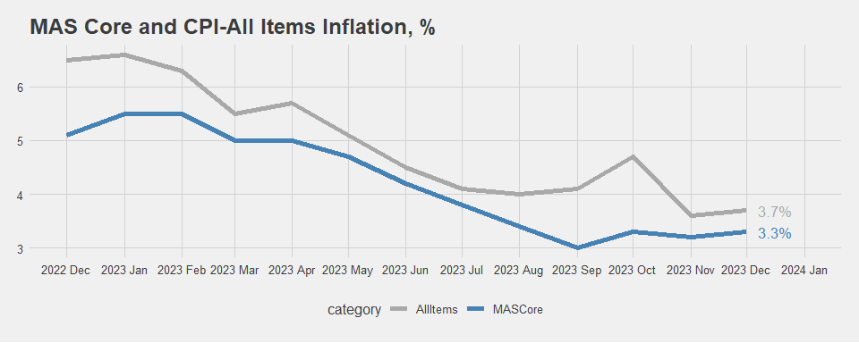

Week 3 Workshop
================
YH
2024-01-31

- [Exercise with data](#exercise-with-data)
  - [CPI for key categories (Page 7 on
    PDF)](#cpi-for-key-categories-page-7-on-pdf)
  - [YOY inflation (Page 8)](#yoy-inflation-page-8)

# Exercise with data

Download `wk3_cpi2023.pdf` from Canvas. The data contain **Singapore’s
Consumer Price Index (CPI) in 2023**. It was originally retrieved from
[MAS](https://www.mas.gov.sg/monetary-policy/consumer-price-developments).

Let’s read the file into `R`.

``` r
library(tidyverse)
library(pdftools)
txt <- pdf_text("../data/wk3_cpi2023.pdf")
```

## CPI for key categories (Page 7 on PDF)

We first extract the table on Page 7. This will give us the **CPI for
key categories, with 2019 as the base year**.

``` r
# Table on page 7
tab1 <- txt[7]

# Split text file into rows
rows <- str_split(tab1, "\\n+", simplify = TRUE) %>% str_trim()
  
# Column names in lines 4-6
names1 <- rows[4] %>%
  str_trim() %>%
  str_split("\\s{2,}", simplify = TRUE)
names2 <- rows[5] %>%
  str_trim() %>%
  str_split("\\s{2,}", simplify = TRUE) %>%
  # adding necessary strings
  append(c("", ""), after = 0) %>%
  append(c("", ""), after = 4)
names3 <- rows[6] %>%
  str_trim() %>%
  str_split("\\s{2,}", simplify = TRUE) %>%
  # adding necessary strings
  append(c("", ""), after = 0) %>%
  append(c("", "", ""), after = 3) %>%
  append(c("", "", ""), after = 7)
colnames <- str_c(names1, names2, names3, sep = " ") %>% 
  str_replace_all("\\s", "") %>%
  append("Month", after = 0)

# Final table on page 7
rows[8:20] %>%
  str_trim() %>%
  str_split("\\s{2,}", simplify = TRUE) %>%
  data.frame() %>%
  setNames(colnames) %>%
  mutate_at(-1, parse_number) -> tab1

tab1
```

    ## # A tibble: 13 × 11
    ##    Month    AllItems MASCore CPILessAccommodation CPILessOOA  Food Services
    ##    <chr>       <dbl>   <dbl>                <dbl>      <dbl> <dbl>    <dbl>
    ##  1 2022 Dec     111.    107.                 112.       112.  112.     106.
    ##  2 2023 Jan     111.    108.                 112.       112.  114.     107.
    ##  3 Feb          112.    108.                 113.       112.  114.     106.
    ##  4 Mar          113.    108.                 113.       113.  114.     106.
    ##  5 Apr          113.    109.                 114.       113.  115.     107.
    ##  6 May          113.    109.                 114.       113.  115.     107.
    ##  7 Jun          114.    109.                 114.       114.  115.     108.
    ##  8 Jul          113.    109.                 114.       114.  115.     108.
    ##  9 Aug          114.    109.                 115.       115.  115.     108.
    ## 10 Sep          115.    110.                 115.       115.  116.     108.
    ## 11 Oct          115.    110.                 116.       116.  116.     109.
    ## 12 Nov          115.    110.                 115.       115.  116.     109.
    ## 13 Dec          115.    111.                 116.       116.  116.     110.
    ## # ℹ 4 more variables: `Retail&OtherGoods` <dbl>, `Electricity&Gas` <dbl>,
    ## #   PrivateTransport <dbl>, Accommodation <dbl>

## YOY inflation (Page 8)

Using a similar approach, we can extract data on Page 8. This gives us
the **year-on-year inflation on key CPI categories**.

``` r
# Table on page 8
tab2 <- txt[8]

# Split text file into rows
rows <- str_split(tab2, "\\n+", simplify = TRUE) %>% str_trim()
# Same column names as the previous table
colnames
```

    ##  [1] "Month"                "AllItems"             "MASCore"             
    ##  [4] "CPILessAccommodation" "CPILessOOA"           "Food"                
    ##  [7] "Services"             "Retail&OtherGoods"    "Electricity&Gas"     
    ## [10] "PrivateTransport"     "Accommodation"

``` r
# Final table on page 8
rows[7:19] %>%
  str_trim() %>%
  str_split("\\s{2,}", simplify = TRUE) %>%
  data.frame() %>%
  setNames(colnames) %>%
  mutate_at(-1, parse_number) -> tab2

tab2
```

    ## # A tibble: 13 × 11
    ##    Month    AllItems MASCore CPILessAccommodation CPILessOOA  Food Services
    ##    <chr>       <dbl>   <dbl>                <dbl>      <dbl> <dbl>    <dbl>
    ##  1 2022 Dec      6.5     5.1                  6.9        6.7   7.5      3.7
    ##  2 2023 Jan      6.6     5.5                  7.1        6.9   8.1      4.2
    ##  3 Feb           6.3     5.5                  6.7        6.5   8.1      3.9
    ##  4 Mar           5.5     5                    5.7        5.6   7.7      3.4
    ##  5 Apr           5.7     5                    6          5.9   7.1      4.3
    ##  6 May           5.1     4.7                  5.2        5.1   6.8      3.9
    ##  7 Jun           4.5     4.2                  4.5        4.5   5.9      3.6
    ##  8 Jul           4.1     3.8                  4          4     5.3      3.6
    ##  9 Aug           4       3.4                  3.9        3.9   4.8      3.1
    ## 10 Sep           4.1     3                    4.1        4.1   4.3      3.1
    ## 11 Oct           4.7     3.3                  4.9        4.9   4.1      3.4
    ## 12 Nov           3.6     3.2                  3.4        3.4   4        3.5
    ## 13 Dec           3.7     3.3                  3.6        3.7   3.7      3.9
    ## # ℹ 4 more variables: `Retail&OtherGoods` <dbl>, `Electricity&Gas` <dbl>,
    ## #   PrivateTransport <dbl>, Accommodation <dbl>

**The following code plots the year-on-year inflation.**

``` r
tab2 %>%
  select(1:3) %>%
  separate(Month, into = c("year", "month"), fill = "left") %>%
  mutate(year = case_when(
    is.na(year) ~ "2023",
    TRUE ~ year
  )) %>%
  mutate(yr_month = ym(paste(year, month, sep = "-"))) %>%
  pivot_longer(AllItems:MASCore, names_to = "category", values_to = "inflation") %>%
  select(yr_month, category, inflation) -> tab3

tab4 <- tab3 %>% filter(yr_month == "2023-12-01")
range <-  c(as.Date("2022-12-01"), as.Date("2024-01-01"))
```

``` r
library(ggthemes)
ggplot(data = tab3, aes(x = yr_month, y = inflation, color = category)) +
  geom_line(lwd = 2) +
  geom_text(data = tab4, aes(label = paste0(inflation, "%")), 
            size = 4.5, hjust = "left", nudge_x = 6, show.legend = FALSE) +
  scale_x_date(date_breaks = "1 month", date_labels = "%Y %b", limits = range) +
  scale_color_manual(values = c("darkgray", "steelblue")) +
  labs(x = "", y = "% YOY", color = "", 
       title = "MAS Core and CPI-All Items Inflation") +
  theme_fivethirtyeight()
```

<!-- -->
